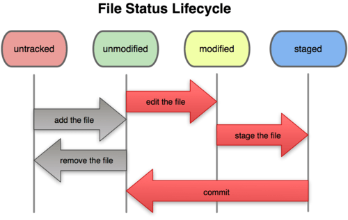

# 7월 6일 복습

## 파일 라이프 사이클

* `$ git status` Working directory와 Staging Area 에 있는 파일들을 확인 할 수 있는 명령어

* `$ git log` 기록된 버전을 확인 할 수 있는 명령어

# 원격저장소(Remote Repsitory)

## 로컬 저장소의 버전(커밋)을 원격저장소로 보내는 방법

#### 1. 원격저장소 설정 `https://github.com/minw0095/TIL.git`

#### 2. 로컬 저장소에서 원격저장소 정보 추가(한번만 설정하면 된다)

`$ git remote add origin https://github.com/minw0095/TIL.git`

#### 3.버전(커밋)을 올리기(push)

`$ git push 원격저장소이름 브랜치이름`  ex) `$ git push origin master`